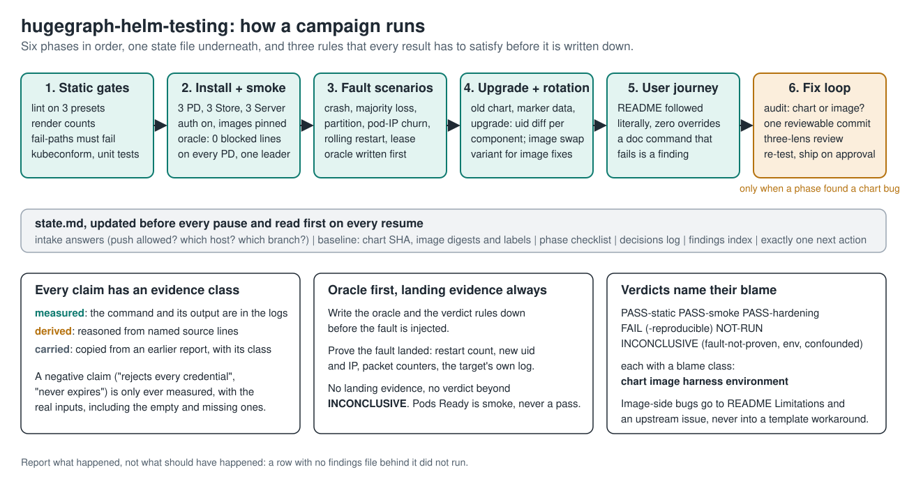

# hugegraph-helm-testing

An agent skill for testing the [Apache HugeGraph](https://hugegraph.apache.org/)
Helm chart the way it fails in production, and for landing chart fixes that
survive independent review. It is written for a coding agent (Claude Code,
Codex, anything that reads `SKILL.md` or `AGENTS.md`), and it reads fine as a
runbook for a person.



## What it does, in one pass

1. **Static gates.** Lint on every preset, render counts, the chart's own
   fail-paths (each must fail), kubeconform at the target Kubernetes version
   and the chart's floor, the unit-test suites.
2. **Install and smoke.** The full 3 PD + 3 Store + 3 Server + Hubble topology
   with authentication on and images pinned to what was loaded. The install
   oracle is not "pods Ready": it is zero allowlist errors on every PD plus one
   clean leader election.
3. **Fault scenarios.** Follower and leader crash, majority loss, Store loss,
   network partition, pod-IP churn, PVC reattach, rolling restart under load,
   auth on every replica, the Server discovery lease. Each scenario writes its
   oracle down before the fault and must prove the fault landed.
4. **Upgrade path and rotation.** Install the previous chart version with marker
   data, upgrade, judge by the pod-uid diff per component. An image-swap
   variant proves an image-side fix and the upgrade path in one cluster.
5. **User journey.** The README followed literally with zero overrides; a
   documented command that fails as written is a finding.
6. **Fix loop**, only when a phase found a chart bug: audit (chart or image?),
   one reviewable commit, a three-lens independent review, a live re-test, and
   shipping only on the owner's approval.

A session state file (`state.md`) is updated before every pause and read first
on every resume, so long campaigns stay grounded in recorded fact rather than
in the agent's memory.

## The three rules that make the results usable

- **Every claim carries an evidence class.** `measured` (the command and its
  output are in the logs), `derived` (reasoned from named source lines), or
  `carried` (copied from an earlier report, with that report's class). A
  negative claim ("rejects every credential", "never expires") is only ever
  measured, with the real inputs, including the empty and the missing ones.
  One such claim once travelled through three reports on source reading alone
  and was disproved by a single curl.
- **Oracle first, landing evidence always.** The oracle and the verdict rules
  are written before the fault is injected. A fault with no landing evidence
  (restart count, new uid and IP, packet counters, the target's own log) is
  `INCONCLUSIVE`, never a pass.
- **Verdicts name their blame.** `PASS-static`, `PASS-smoke`,
  `PASS-hardening`, `FAIL`, `INCONCLUSIVE`, `NOT-RUN`, each with a blame class
  of chart, image, harness or environment. Image-side bugs go into the chart's
  README Limitations and an upstream issue, never into a template workaround.

## What's inside

```
hugegraph-helm-testing/
├── SKILL.md                      # entry point: phases, load-bearing facts, non-negotiables
├── AGENTS.md                     # routes AGENTS.md-reading agents into SKILL.md
├── docs/overview.svg             # the picture above
└── references/
    ├── test-suite.md             # the battery: static, install, scenarios, claim taxonomy, endpoints, upgrade, journey
    ├── pitfalls.md               # tooling behaviours that silently invalidate results
    ├── ipauth-bug-family.md      # the PD allowlist bug: mechanics, signatures, remediation
    ├── chart-engineering.md      # fix patterns: gates, lookup checksums, lifecycle fields, schema discipline
    ├── fix-loop.md               # report, audit, fix, review, re-test, ship
    └── evidence.md               # the worked case study, with real log lines and shipped code
```

`SKILL.md` is loaded every session and holds the rules; the references are
loaded when a phase starts.

## Install

**Claude Code** (or any Agent Skills runtime): clone into your skills directory.

```bash
git clone https://github.com/bitflicker64/hugegraph-helm-testing ~/.claude/skills/hugegraph-helm-testing
```

**Codex** (or any AGENTS.md-reading agent): clone it into your workspace, next
to your hugegraph checkout; the bundled `AGENTS.md` routes the agent into
`SKILL.md`.

```bash
git clone https://github.com/bitflicker64/hugegraph-helm-testing
```

Then ask the agent to "test the HugeGraph helm chart" or anything close. It
starts with a short intake (push allowed? local or remote host? which branch?
how deep?) and creates the state file before it runs anything.

## What you need

- `kind`, `helm` v3, `kubectl`, `curl`, and Docker with about 12 GB free for
  the full topology (ten JVMs). A 1+1+1 run through `values-single.yaml` fits
  far smaller hosts.
- A checkout of the chart: `helm/hugegraph` in a hugegraph clone, or a
  standalone chart directory.
- Component images. Pinned digests are best. When the branch under test has no
  published images, the suite explains how to build them from that tree with
  the revision label stamped in, and how to read the label back from the
  running pods.

## Where it came from

Six campaigns against the chart in [apache/hugegraph#3132](https://github.com/apache/hugegraph/pull/3132)
between August and September 2026: Kind on laptops and workstations, a
four-node bare-metal cluster with Chaos Mesh, and images built straight from a
testing branch. The campaigns found and filed the PD readiness gap
([#3183](https://github.com/apache/hugegraph/issues/3183), fix
[#3185](https://github.com/apache/hugegraph/pull/3185)), the Server startup
self-termination ([#3186](https://github.com/apache/hugegraph/issues/3186), fix
[#3187](https://github.com/apache/hugegraph/pull/3187)) and the PD REST
name-only authentication ([#3188](https://github.com/apache/hugegraph/issues/3188),
fix [#3189](https://github.com/apache/hugegraph/pull/3189)), then measured the
three fixes end to end on images built from a tree that carried them. Every
rule in the skill is there because it caught a real bug, or because it was the
mistake that hid one; `references/pitfalls.md` is the list of those mistakes.

## License

Apache License 2.0, the same as HugeGraph. See `LICENSE`.
